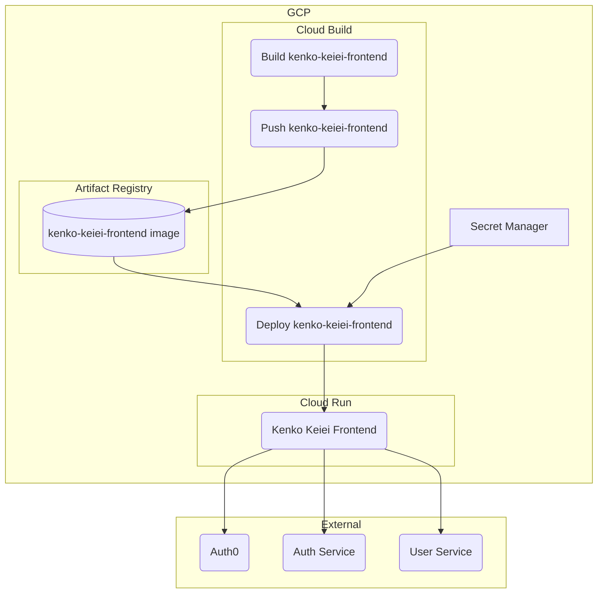

# Kenko Keiei Frontend

[kenko-keiei.qkitzero.xyz](https://kenko-keiei.qkitzero.xyz)

```mermaid
flowchart TD
    subgraph gcp[GCP]
        secret_manager[Secret Manager]

        subgraph cloud_build[Cloud Build]
            build_kenko_keiei_frontend(Build kenko-keiei-frontend)
            push_kenko_keiei_frontend(Push kenko-keiei-frontend)
            deploy_kenko_keiei_frontend(Deploy kenko-keiei-frontend)
        end

        subgraph artifact_registry[Artifact Registry]
            kenko_keiei_frontend_image[(kenko-keiei-frontend image)]
        end

        subgraph cloud_run[Cloud Run]
            kenko_keiei_frontend(Kenko Keiei Frontend)
        end
    end

    subgraph external[External]
        auth0(Auth0)
        auth_service(Auth Service)
        user_service(User Service)
    end

    build_kenko_keiei_frontend --> push_kenko_keiei_frontend --> kenko_keiei_frontend_image

    kenko_keiei_frontend_image --> deploy_kenko_keiei_frontend --> kenko_keiei_frontend

    secret_manager --> deploy_kenko_keiei_frontend

    kenko_keiei_frontend --> auth0
    kenko_keiei_frontend --> auth_service
    kenko_keiei_frontend --> user_service
```
